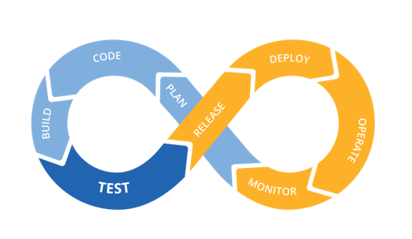

---
htmlHead:
    title: 'marlou knowledge base' 
    containerClass: 'markdown-body'
    metaTags:
        - name: viewport
          content: 'width=device-width, initial-scale=1, minimal-ui'
        - name: robots
          content: none
    links:
        - href: '../github-markdown.css'
          rel: stylesheet
          media: all
        - href: '../main.css'
          rel: stylesheet
          media: all
        - href: '../github.css'
          rel: stylesheet
    scripts:
        - src: '../index.js'

---

# devops - overview

## what is devops

[Devops - wikipedia.fr](https://fr.wikipedia.org/wiki/Devops)

> Apparu vers 2010, le mouvement Devops se caractérise principalement par la promotion de l'automation et du suivi (monitoring) de toutes les étapes de la création d'un logiciel, depuis le développement, l'intégration, les tests, la livraison jusqu'au déploiement, l'exploitation et la maintenance des infrastructures. Les principes Devops soutiennent des cycles de développement plus courts, une augmentation de la fréquence des déploiements et des livraisons continues, pour une meilleure atteinte des objectifs économiques de l'entreprise.

[Patrick Debois - fr.wikipedia.org](https://fr.wikipedia.org/wiki/Patrick_Debois)

> Inventeur du mot devops qui désigne une approche fédérée des développements informatiques (build) et des opérations (run). 

[Patrick Debois - site perso - www.jedi.be](http://www.jedi.be/presentations/)

[Patrick Debois - twitter.com](https://twitter.com/patrickdebois)

[Il était une fois … l’histoire du DevOps - www.oxalide.com - 20140627](https://www.oxalide.com/il-etait-fois-lhistoire-du-mouvement-devops/)

[DevOps Culture (Part 1) - itrevolution.com - 20120501](https://itrevolution.com/devops-culture-part-1/)

### DevOps pipeline



[Contruire un pipeline DevOps - jch.blog4ever.com - Jean Chambard - 20180217](https://jch.blog4ever.com/contruire-un-pipeline-devops)

> liste les outils associés à chaque étape de la pipeline :
> 
> Plan → Code → Build → Test → Release → Deploy → Operate → Monitor
>
> **Plan** :
> 
> - Micro Focus (anciennement HPE) [Agile Manager](https://software.microfocus.com/fr-fr/software/agile-project-management-software-development)
> - Microsoft [Team Fondation Server](https://www.visualstudio.com/fr/tfs/) (TFS)
> - CA [Agile Central](https://www.ca.com/fr/products/ca-agile-central.html) (anciennement Rally)
> - Atlassian [Jira Software](https://fr.atlassian.com/software/jira) (connu pour son outil de bug tracking)
> - [Trello](https://trello.com/) (de la société éponyme, spin off de Fog Creek Software) : orienté tâches ;
> - CollabNet [ScrumWorks](https://www.collab.net/products/scrumworks)
> - Thoughtworks [Mingle](https://www.thoughtworks.com/mingle/)
> - [Wrike](https://www.wrike.com/fr/) (de la société éponyme)
> - [Asana](https://asana.com/fr/) (de la société éponyme) : orienté tâches
> 
> **Code** :
> 
> - [Git](https://git-scm.com/) (l'outil) ou [GitHub](https://github.com/) (le service)
> - Mercurial [Source Version Control](https://www.mercurial-scm.org/) (SVC)
> - Canonical [Bazaar](http://bazaar.canonical.com/en/)
> - Fossil [Source Version Control](https://www.fossil-scm.org/index.html/doc/trunk/www/index.wiki)
> 
> **Build** :
> 
> - [Hudson](http://hudson-ci.org/)
> - [Jenkins](https://jenkins.io/)
> - Atlassian [Bamboo](https://fr.atlassian.com/software/bamboo)
> - Jetbrains [Teamcity](https://www.jetbrains.com/teamcity/)
> - Microsoft [TFS](https://www.visualstudio.com/fr/tfs/)
> 
> **Test** :
> 
> - [Selenium](http://www.seleniumhq.org/), pour tester toutes les applications avec une interface utilisateur basée sur un navigateur Web.
> - Micro Focus (Ex HPE) [Unified Functionnel Testing](https://software.microfocus.com/en-us/products/unified-functional-automated-testing/overview) (UFT).
> - Tricentis [Tosca](https://www.tricentis.com/software-testing-tools/), son challenger.
> - Smartbear [TestComplete](https://smartbear.com/product/testcomplete/overview/)
> - IBM [Rational](https://www-03.ibm.com/software/products/fr/rtw) Test Workbench. Il faut mieux avoir la suite Rational et un bon Mainframe pour ce genre d'outils.
> 
> **Release** :
> 
> - [Sonatype Nexus](http://www.sonatype.org/nexus/)
> - [Apache Archiva](https://archiva.apache.org/index.cgi)
> - [JFrog Artifactory](https://jfrog.com/artifactory/)
> 
> **Deploy** :
> 
> - *déploiement*
>   - [Jenkins](https://jenkins.io/). En sus d'assurer l'intégration continue, Jenkins est aussi capable de faire du déploiement continu. Mais cela reste assez rudimentaire. Pour des outils un peu plus évolués, il faut s'orienter vers des outils payants, qui offrent de nombreux plugins et interfaces.
>   - Electric Cloud [ElectricFlow](http://electric-cloud.com/products/electricflow/)
>   - XebiaLabs [XL-Deploy](https://xebialabs.com/products/xl-deploy/). Un des leaders en France.
>   - CA Technologies [Automic Release Automation](https://automic.com/fr/products/automic-release-automation) (rachat). Notons qu'Automic a réalisé un belle cartographie des différents outils, qui vaut le coup d'oeil.
>   - Octopus [Deploy](https://octopus.com/)
>   - IBM [UrbanCode Deploy](https://www-03.ibm.com/software/products/fr/ucdep) (rachat)
> 
> - *provisioning*
>   - [Chef](https://www.chef.io/chef/).
>   - [Puppet](https://puppet.com/fr).
>   - [Ansible](https://www.ansible.com/). Sans doute le plus simple des 3 produits, et fonctionnant sans agent, ce qui fait son succès, mais aussi le plus limité de ce fait.
>   - Mentionnons aussi SaltStack et Fabric, des outils assez frustres de déploiement mais qui ont l'avantage d'être simples et gratuits.
> 
> - *suivi*
>   - L'outil le plus connu est certainement XebiaLabs [XL-Release](https://xebialabs.com/products/xl-release/).
>   - IBM [UrbanCode](https://www-03.ibm.com/software/products/fr/ucrel) Release
>   - CA Technologies [Automic Release Automation](https://automic.com/fr/products/automic-release-automation)
>   - BMC [Release Process Management](http://www.bmcsoftware.fr/it-solutions/release-process-management.html)
> 
> **Operate** :
> 
> - Les conteneurs Linux [LXC](https://linuxcontainers.org/fr/)
> - [Docker](https://www.docker.com/) (qui n'est qu'une évolution des conteneurs LXC) et Docker Swarm pour la gestion des clusters, du routage, de la scalability.
> - Apache [Mesos](http://mesos.apache.org/) ; ce n'est pas un système de container mais plutôt un OS distribué supportant un système de container tel que Docker. Intéressant pour sa scalability.
> - [Kubernetes](https://kubernetes.io/) : un système open source conçu à l'origine par Google et offert à la Cloud Native Computing Foundation. Il vise à fournir une « plate-forme permettant d'automatiser le déploiement, la montée en charge et la mise en œuvre de conteneurs d'applications sur des clusters de serveurs ». A noter que Docker offre maintenant le support de Kubertenes dans la Docker Community Edition pour les developpeurs sous Windows et macOS, et dans la Docker Enterprise Edition.
> - Les conteneurs [Windows](https://www.microsoft.com/fr-fr/cloud-platform/containers) de chez Microsoft
> 
> **Monitor** :
> 
> - Dynatrace DCRUM et Purepath ([APM](https://www.dynatrace.com/capabilities/#application-monitoring--performance-lifecycle-management))
> - Appdynamics [APM](https://www.appdynamics.com/product/application-performance-management/)
> - New Relic [APM](https://newrelic.com/application-monitoring)
> 
> En complément :
> 
> - [ELK](https://www.elastic.co/fr/products) : acronyme pour 3 projets open source, Elasticsearch, Logstash, et Kibana. Ce triptyque est très répandu et utilisé notamment pour la supervision de la sécurité, mais pas que.
> - [Splunk](https://www.splunk.com/fr_fr) : C'est une sorte de plate-forme d'Intelligence Opérationnelle (par opposition à la Business Intelligence) temps réel. On peut ainsi explorer, surveiller, analyser et visualiser les données machine via Splunk.
> - [DataDog](https://www.datadoghq.com/) : DataDog est une excellente alternative à Splunk. La solution fonctionne aussi sur des environnements dans le Cloud.

### resources

[devops.com](https://devops.com/)

[DORA - DevOps Research and Assessment](https://devops-research.com/)

[Accelerate - Nicole Forsgren, Jez Humble and Gene Kim - 20180327](https://itrevolution.com/book/accelerate/)

> Scientific study giving results and methodology about the puppet.com states of Devops from 2014 to 2017 (the books authors contributed to theses studies)
> 
> Martin Fowler preface

[The state of devops 2018 - puppet.com](https://puppet.com/resources/whitepaper/state-of-devops-report)

[The state of devops 2017 - puppet.com](https://puppet.com/blog/2017-state-devops-report-here)

> High performing organizations that effectively utilize DevOps principles achieve:
> 
> - 46x more frequent software deployments than their competitors.
> - 96x faster recovery from failures.
> - 440x faster lead time for changes.
> - Higher levels of customer satisfaction and operational efficiency.

[The state of devops 2016 - puppet.com](https://puppet.com/resources/whitepaper/2016-state-of-devops-report)

[The state of devops 2015 - puppet.com](https://puppet.com/resources/whitepaper/2015-state-devops-report)

[The state of devops 2014 - puppet.com](https://puppet.com/resources/whitepaper/2014-state-devops-report)

[The state of devops 2013 - puppet.com](https://puppet.com/resources/whitepaper/2013-state-devops-report)

[Containers + Kubernetes + OpenStack : la plateforme du futur ? - Rafaël Portolano, Dynatrace - 20171128](https://www.informatiquenews.fr/containers-kubernetes-openstack-plateforme-futur-rafael-portolano-dynatrace-54732)

### devops and outsourcing

[Will DevOps Kill IT Outsourcing?: Part 1 - devops.com - 20150803](https://devops.com/will-devops-kill-it-outsourcing-part-1/)

> According to [a report out earlier this spring by outsourcing research firm Information Services Group (ISG)](http://www.cio.com/article/2917376/outsourcing/it-outsourcing-deal-values-hit-10-year-low.html), average outsourcing contract values saw their worst first quarter in a decade, dropping by 27 percent year-over-year. Big deals over $30 million were particularly hit hard, declining by 25 percent in both number and value.
> 
> "I hear many more negative experiences organizations have had with outsourcing arrangements than I do positive ones," he says. "Poor quality. Higher-than-expected management overhead required. Inflexibility. Process challenges. All are reasons cited for why the arrangements didn’t live up to expectations."
> 
> The anecdotal stories are also piling up of big name enterprises pulling more of their IT resources back in house after years of outsourcing.
> 
> "Outsourcing in an enterprise setting is often implemented in a way that advances outdated waterfall-like practices and processes that are antithetical to continuous delivery," Braunhut says.
> 
> "To be most effective, enterprises need to own the transformation, and it has to be a truly collaborative effort across disciplines–business leadership, engineering, system administration, security & compliance,"says Thomas Enochs, vice president of customer success at Chef. "ollaboration and transformation are difficult to achieve with outside third parties or vendors. They need to own and drive the change themselves, and not be dependent on others."

## cloud

### VMs vs Containers

[Containers and VMs - A Practical Comparison](https://www.youtube.com/watch?v=L1ie8negCjc)

```

      **VM**                                                   **Containers**

+-----------------+                                         +-----------------+ <-+ 
|       App       |                                         |       App       |   | All
|                 |                                         |                 |   | this part
+-----------------+                                         +-----------------+   | is a
         |                                                  | OS Dependencies |   | container
         |                                                  +-----------------+ <-+
         V
+-----------------+                                         +--------+--------+
|   Dependencies  |  <-- config                             |        | Docker |
+-----------------+                                         |        +--------+
|       OS        |                                         |                 |
|                 |                                         |      OS         |
+-----------------+                                         +-----------------+

     < VM >   NIC, Storage, Size                                  < VM >
     < VSphere, HV, NSX, VSAN > NIC, Storage,                     < HV >
                                Agents, Kernel

+-----------------+                                         +-----------------+
|                 |                                         |                 |
|    Physical     |                                         |    Physical     |
|                 |                                         |                 |
+-----------------+                                         +-----------------+

```

### IaaS

**Infrastructure As A Service**

Amazon EC2, Windows Azure, RackSpace, CloudWatt, ...

[openstack](https://www.redhat.com/fr/topics/openstack)

[Dropbox saved almost $75 million over two years by building its own tech infrastructure - www.geekwire.com - 20180223](https://www.geekwire.com/2018/dropbox-saved-almost-75-million-two-years-building-tech-infrastructure/)

### PaaS

**Platform As A Service**

Heroku, ...

### SaaS

**Software As A Service**

Any software hosted elsewhere on the internet (a webmail, a source code repository, a billing solution, etc ...)

### FaaS

**Function As A Service**

Just host a simple function, give it data and get a result.

## containers and containers orchestrators

[What is a Container? - VMware Cloud-Native](https://www.youtube.com/watch?v=EnJ7qX9fkcU)

- Simplist form of what a container is : a sandbox for a process (goal is to running a process in isolation)

Most fundamentals notions of the runtime definition of a container :

**process namespace** (only that process shown by `ps` command)

**Cgroups** allows to restrict what containerized process are allowed to do (capabilities, ressources, ...)

Container life cycle and associated process are bounds.

- An image is a tree of images (image of OS, images of binaries (ssh, perl, ...), image of your app)

Each image can be seen as a binary snapshot (ssh in version x.y.z for ex).

It means you can compose your image with several others images instead of creating a monolitic full stack image.

- Docker

a docker file is a starting point for an image.

A container is packaged with all of his dependencies.

With a classical install for your app, your are limited by deps installed on your system.

With a container, it is expected that all the deps above the kernel are packaged inside the container.
So when you run your container inside an OS, it don't install anything. It sits above the OS in its own world.
If you delete your image, you the OS state is unchanged.

- Docker host

A docker host tight the runtime container, the images and the docker file together.

A docker host have a cache of the docker registry. The registry contains the images of binaries (each available versions).

You can pull and push from the registry. There is a diff with the cache to pull/push only what is needed.

The docker client talk (pull, create, run, commit, ...) to the daemon in docker host. Not only container life cycle management
but also network and storage config.

A docker host can contains also a Volume from a docker image. A Volume is the saved state (storage) of the container.
Deleting a container is also deleting his state, the Volume.


[Characterizing and Contrasting Container Orchestrators - devops.com - 20170920](https://devops.com/characterizing-and-contrasting-container-orchestrators/)

> super quick evaluation of :
> - Nomad
> - Docker Swarm
> - Kubernetes
> - Mesos-Marathon

### docker, kubernetes

[The Advantages of Using Kubernetes and Docker Together - 20180507](https://cmelendeztech.com/posts/2018/05/kubernetes-docker-deployments.html)

> - Everything Starts With Your Local Environment
> - Use Docker to Pack and Ship Your App
> - Use Kubernetes to Deploy and Scale Your App
> - You’ll Deliver Quickly, Consistently, and Predictably

[Docker, Kubernetes et Istio, c'est utile pour mon monolithe? (D. Gageot) - DevoxxFR 2018](https://www.youtube.com/watch?v=Z_sNyT0hcVw)

> Pour développer et mettre en production une architecture à base de micro-services, Docker, Kubernetes et Istio s'imposent. Docker nous donne l'isolation des services, Kubernetes permet de les distribuer sur un cluster et Istio apporte de l'intelligence au réseau.
>
> Mais voilà, comme 80% des développeurs, c'est une application monolithique et paléolithique que je dois moderniser. Comment puis-je tirer tous les bénéfices de ces outils ? Puis-je le faire sans toucher une ligne de code de mon application ?
>
> Simplification des montées de version, Déploiement sur le Cloud, Sécurisation des flux, Terminaison SSL, Blue/Green deployments, A/B Testing, Monitoring des Apis... Autant de cas concrets que l'on mettra en oeuvre sans toucher au monolithe !!

### links

- [post linkedin : Développeur tu mets  combien de temps pour pousser ton code en prod ? : Denis Barthélemy R&D director @ One2Team](https://www.linkedin.com/feed/update/urn:li:activity:6324113425068814336)

> - LesFurets.com @Dimitri Baeli : J+1 (h+1 hotfix) (500K LoC, codebase age 10 ans, 25 devs)
> - BlaBlaCar @Nicolas Tricot : 45 mins entre git push et deploy prod

